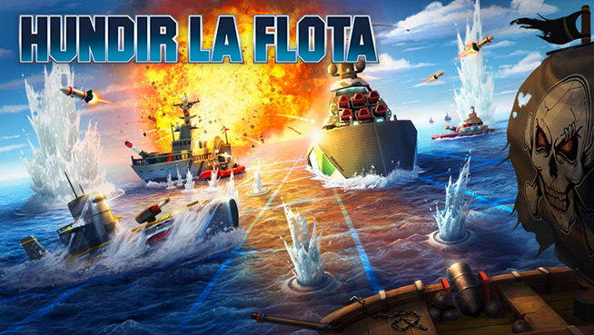

# ***PROYECTO HUNDIR LA FLOTA***

## Autores

- Cristian España
- Arturo Guzmán

### DESCRIPCIÓN DEL PROYECTO

El **objetivo principal** del proyecto es aplicar todo lo visto durante estas semanas del bootcamp para desarrollar el juego de **'Hundir la flota'**. Para ello hemos utilizado como programa principal **Pycharm**, en el que hemos creado 3 scripts distintos:

- **Main**: donde aparece reflejado todo el código y el desarrollo del juego.
- **Utils**: donde se recogen todas las funciones que se van a utilizar luego en el script 'main'.
- **Constants**: donde se encuentran las variables que se emplearán a lo largo del código donde se ejecuta el juego.
    
Para implementar el código hemos hecho uso de las siguientes librerías:

- **Numpy**
- **Time (módulo de Python)**: para darle tiempo de espera a la máquina tras realizar el disparo, de tal forma que aporte una experiencia de juego más real.

El proyecto trata de simular el juego de mesa de **Hundir la flota**. Ha sido realizado con el lenguaje de programación de **Python** utilizando como IDE **Pycharm**. Hemos empleado también el **JupyterLab**, donde se iba probando el código para ver los resultados que se iban obteniendo y los printeos que iba realizando el código. Una vez probado, se iban traspasando al IDE donde se iba colocando en el lugar correspondiente y dándole forma al desarrollo del juego.
